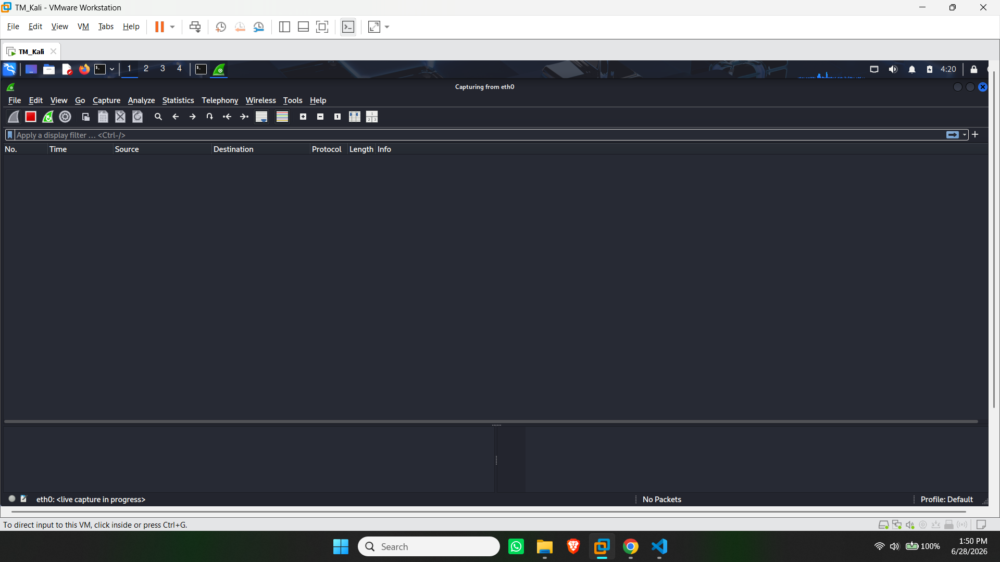
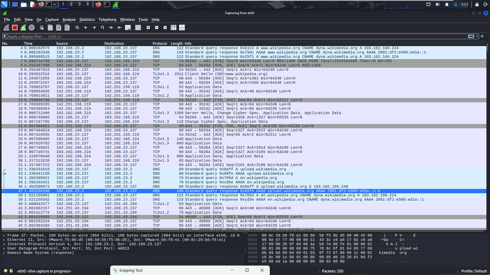
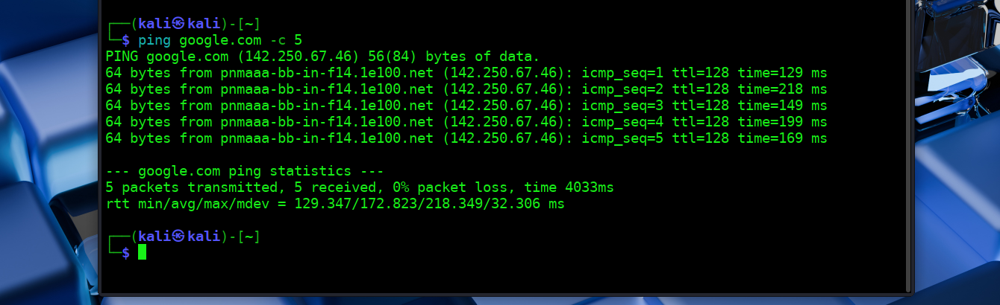
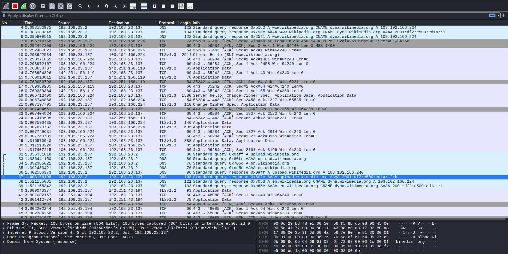
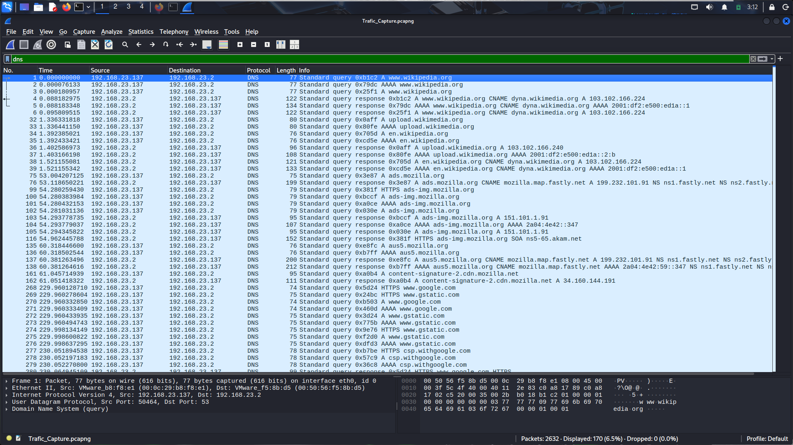
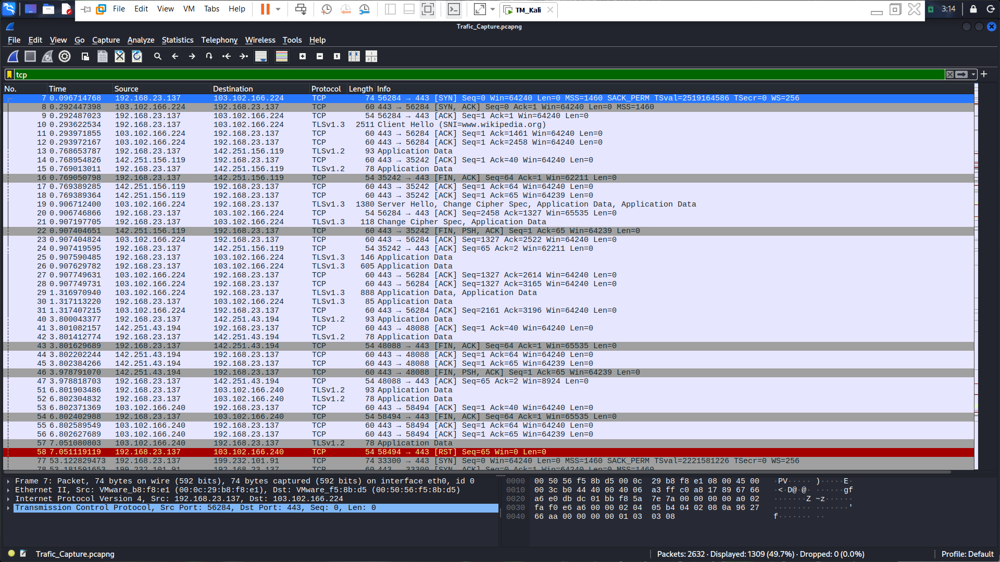
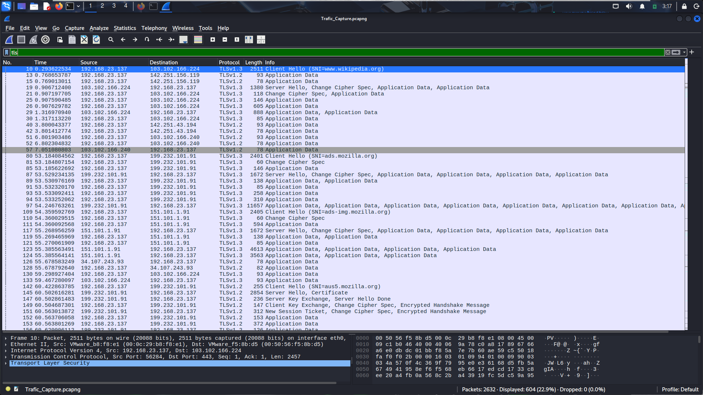
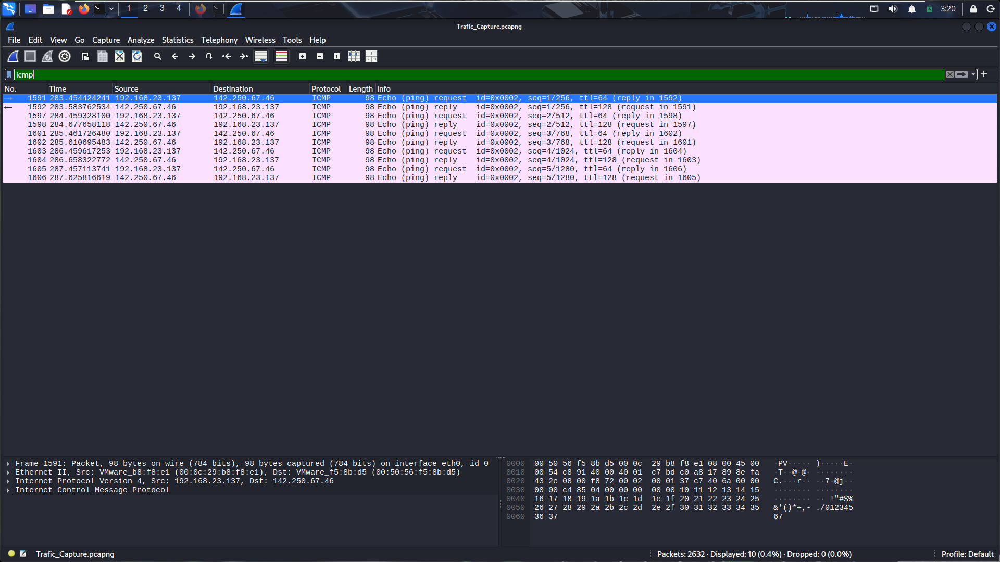
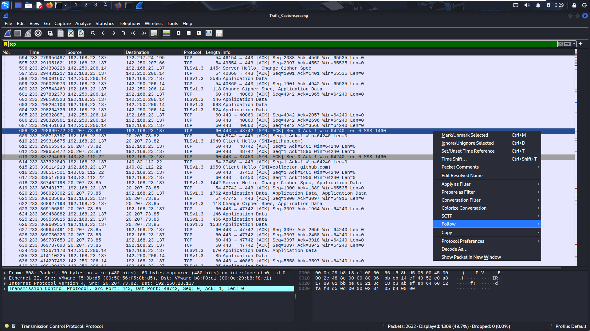
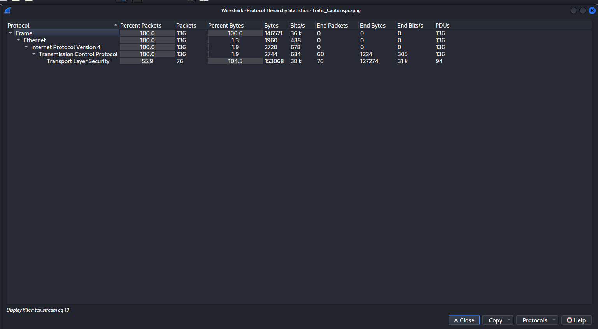

# Network Traffic Analysis using Wireshark

## Project Overview

This project demonstrates the process of capturing and analyzing live network traffic using Wireshark. The objective is to understand how different network protocols communicate across a network and to gain practical experience in packet analysis from a Security Operations Center (SOC) perspective.

---

## Project Objective

- Capture live network traffic.
- Analyze common network protocols.
- Understand packet flow and protocol communication.
- Perform basic network traffic analysis.
- Develop practical skills in Wireshark.

---

## Tools Used

- Wireshark
- Kali Linux
- Terminal
- Google Chrome / Firefox

---

## Network Protocols Analyzed

- DNS
- TCP
- TLS
- ICMP
- IPv4
- UDP

---

## Methodology

1. Started Wireshark.
2. Selected the active network interface.
3. Captured live network traffic.
4. Generated traffic by browsing websites.
5. Executed ICMP requests using the ping command.
6. Applied protocol filters.
7. Analyzed captured packets.
8. Reviewed protocol hierarchy.

---

# Screenshots

## 1. Wireshark Home Screen

---

## 2. Packet Capture Started

---

## 3. ICMP Ping

---

## 4. Captured Packet List

---

## 5. DNS Analysis

DNS packets were captured successfully while resolving domain names into IP addresses.

---

## 6. TCP Analysis

TCP packets were analyzed to observe reliable communication between client and server.

---

## 7. TLS Analysis

Encrypted HTTPS traffic was observed using the TLS protocol.

---

## 8. ICMP Analysis

ICMP Echo Request and Echo Reply packets were captured using the ping command.

---

## 9. TCP Stream Analysis

The Follow TCP Stream feature was used to inspect communication between the client and the server.

---

## 10. Protocol Hierarchy

Protocol Hierarchy was used to identify the distribution of captured protocols.

---

# Key Findings

- Successfully captured live network traffic.
- Observed DNS name resolution.
- Analyzed TCP communication.
- Identified encrypted TLS traffic.
- Verified ICMP communication.
- Reviewed protocol hierarchy statistics.

---

# Skills Demonstrated

- Packet Capture
- Network Traffic Analysis
- Protocol Analysis
- DNS Analysis
- TCP Analysis
- ICMP Analysis
- Wireshark
- Basic SOC Investigation

---

# Conclusion

This project provided hands-on experience in network packet capture and protocol analysis using Wireshark. It strengthened practical knowledge of network communication and basic traffic investigation techniques commonly used by Security Operations Center (SOC) analysts.